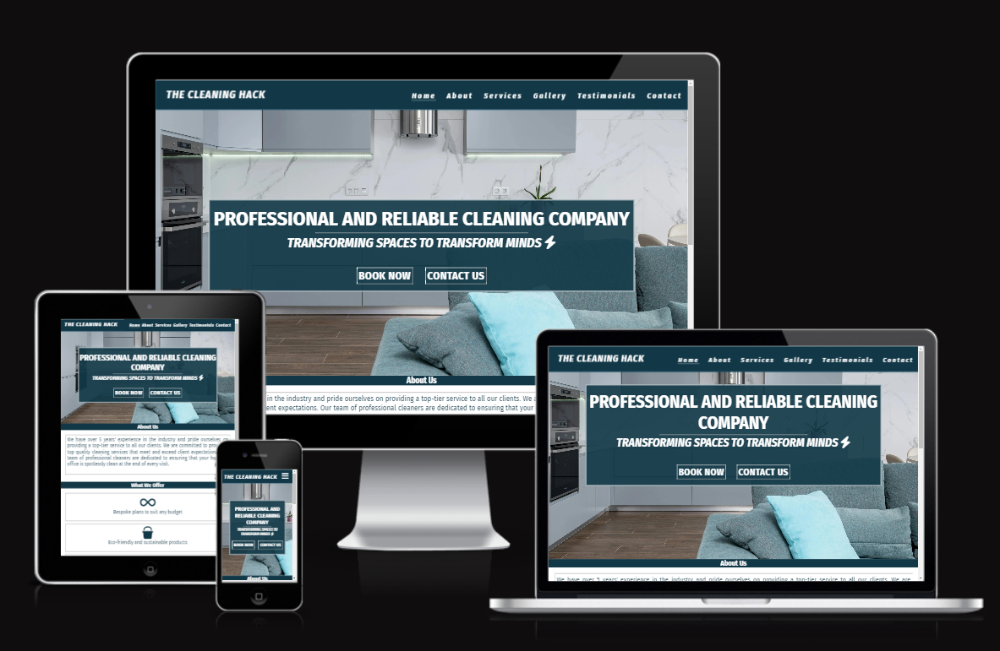
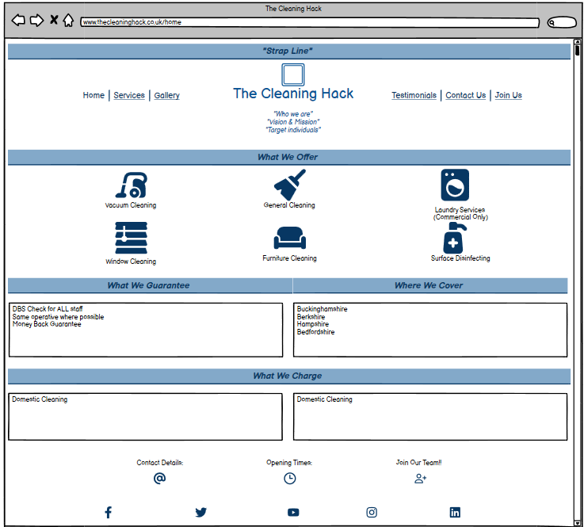
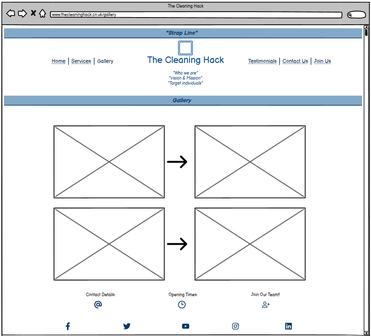
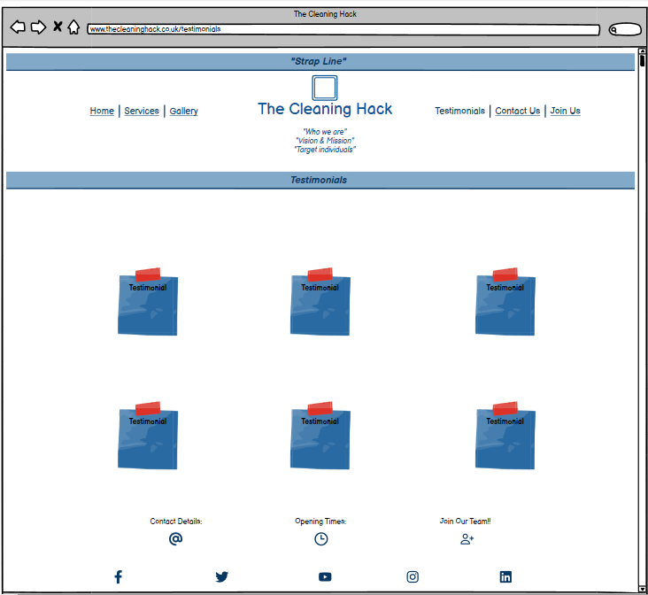
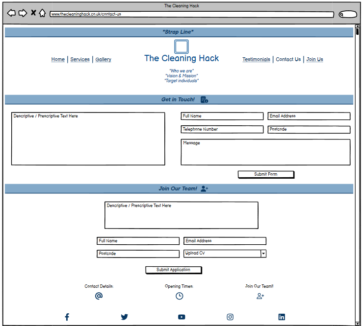

# The Cleaning Hack

This website is built for my partner's cleaning business based out of Buckinghamshire, England.

## [Live Site](https://bakinmarin.github.io/the-cleaning-hack/)

## [Repository](https://github.com/BAkinmarin/the-cleaning-hack)

##  Table of Contents
1.  [UX](#ux)
2.  [Features](#features)
3.  [Features Left To Implement](#features-left-to-implement)
4.  [Technology Used](#technology-used)
5.  [Testing](#testing)
6.  [Bugs](#bugs)
7.  [Deployment](#deployment)
8.  [Credits](#credits)
9.  [Content](#content)
10. [Acknowledgements](#acknowledgements)

## UX

### Planning

In the ideation stage, I had discussions with a number of people, in particular, my partner and sister, as I was keen to build a website which would fulfill a real need. Discussions left me with two viable options - a website for my sister to publish her stories or a website for my partners current cleaning business. 

>Both options were weighed against each other

### Design

### Strategy Plane

### User Stories

### User

### Business Owner

### Scope Plane

### Structure Plane

### Home Page

### About 

### Portfolio

### Contact

### Skeleton Plane

### Balsamiq Wireframes

>Description here

### Surface Plane

### Color

### Typography

## Features
- Navigation Bar
    - Fully responsive navigation bar on all pages except 'About' and 'Services' pages as these link to sections on the index.html page.
    - The navigation bar is large enough to be clickable on smaller devices and provide easy transition between various pages without the need of the 'back' browser button.

>Place screenshot of landing page here

- The Landing Page
    - The landing page includes a hero image with the Company slogan and two call to action buttons, 'Book Now' and 'Enquire Now'.
    - The 'Book Now' button is a convenient way of existing customers to schedule a deep clean visit with the Cleaning Hack or amend an existing booking. It is also handy for visitors who are less interested in perusing the contents of each page and just need a quote or wanting to ask questions. 

- The Cleaning Hack About Section

- The Cleaning Hack Services Section

- The Cleaning Hack Testimonials Section

- The Cleaning Hack Gallery Section

- The Cleaning Hack Contact Section

## Features Left to Implement

## Technology used

#### HTML
>The backbone of website design and function; used to provide structure to the website.

#### CSS
>Used to style the layout of each web page.

#### Font Awesome
>Source of all the icons used in this project.

#### Google Fonts
>Used to define the fonts used in the project (with the exclusion of the company logo). Also used to compate and pair font-styles.

#### Favicon.io
>Used to generate a favicon for the existing logo.

#### Convert.io and Freeconvert.com
>Used in the conversion of files from jpeg and png to webp to aid in faster webpage loading.

## Testing
>Project testing was done manually by myself, my partner, my sister and a couple friends from the Slack community. This was necessary to determine the usability, stability and responsiveness of the website and to gauage if the website is user-friendly. 

### Testing Phase

#### Links and Contact Form
 | Test                                                      | Expectation | Outcome |
 |-----------------------------------------------------------|-------------|---------|
 | Navigation links lead to their intended pages             | Pass        | Pass    |
 | Book Now button leads to external booking page            | Pass        | Pass    |
 | Contact Us button leads to contact form on contact page   | Pass        | Pass    |
 | Learn More button leads to about page                     | Pass        | Pass    |
 | Social links on footer lead to their respective pages     | Pass        | Pass    |
 | Booking and social links open in a new tab                | Pass        | Pass    |
 | Get Quote button leads to contact form on contact page    | Pass        | Pass    |
 | Send Message and Clear Form buttons on contact form work  | Pass        | Pass    |
 | Users prevented from submitting empty form                | Pass        | Pass    |
 | Users prevented from submitting incorrect email format    | Pass        | Pass    |

 #### Testing for responsiveness
 | Test                                                      | Expectation | Outcome |
 |-----------------------------------------------------------|-------------|---------|
 | Home, about, services, gallery, testimonials and contact pages display correctly on mobiles and tablets (769px and lower)                       | Pass        | Pass    |
 | Home, about, services, gallery, testimonials and contact pages display correctly on laptops and desktops (992px and higher - up to 1200px)      | Pass        | Pass    |

 ### User Testing

 #### User testing Challenge

- HTML
    - Add Link

- CSS 
    - Add Link

## Bugs

## Deployment

## Credits

## Content

- Media

## Acknowledgements

