# The Cleaning Hack

This is a website built for the owner of a growing cleaning business based in Buckinghamshire with operations extending to Berkshire, Hertfordshire and Bedfordshire.

## [Live Site](https://bakinmarin.github.io/the-cleaning-hack/)

## [Repository](https://github.com/BAkinmarin/the-cleaning-hack)

##  Table of Contents
1.  [UX](#ux)
2.  [Existing Features](#features)
3.  [Future Features](#future-features)
4.  [Technology Used](#technology)
5.  [Testing](#testing)
6.  [Bugs](#bugs)
7.  [Deployment](#deployment)
8.  [Credits](#credits)
9.  [Content](#content)
10. [Acknowledgements](#acknowledgements)

## UX
### Project Planning
During the project ideation stage, I restricted my point of reference to close friends and family as I was keen to build a website which would fulfill a real need for someone close to me. Discussions left me with three viable options - redesign my church website, design and develop a dedicated website for publishing stories, or design and develop a dedicated website for a cleaning business, The Cleaning Hack. 

All three options were considered in relation to existing technologies and potential alternatives. I chose the option to create a dedicated website for The Cleaning Hack. I decided this choice would be most advantageous overall as it would enhance the business owner's ability to market their services and broaden their reach, utimately contributing to their growth and success.

### Strategy Plane
#### User
As a user I want to be able to find a reliable cleaner in my area to clean my house.

As a user I want to be able to contact the user via email or phone.

As a user I want to be able to request a quote online.

As a user I want to be able to book an appointment online.

As a user I want to be able to see the price before booking an appointment.

As a user I want to be able to see evidence of previous work.

As a user I want to be able to read or hear from other people that have used this cleaner.

As a user I want to be able to find out when the business is open.

As a user I want to be able to view social media accounts.

#### Business Owner
As the site owner, I want to showcase the value we provide and the quality of work we deliver to our clients.

As the site owner, I want to build trust and showcase our professionalism and reliability.

As the site owner, I want to generate leads and provide an easy way for prospects to book in and / or request quotes.

As the site owner I want to use this website to attract more prospects from in and around Buckinghamshire.

As the site owner, I want to attract potential talent to work for us.

As the site owner I want the user to see my business opening hours.

### Scope Plane
The website should have a navigation menu that is consistent across all pages and devices.

The website should have clear messaging to users explaining who we are and what we do.

The website should provide a succinct list of services we provide to the user.

The website should build trust with the user through evidence provided in the form of testimonials and photos of cleaning jobs completed.

The website should provide the user with a way to contact the business for quotes or consultations through a form.

The website should provide the user with details of areas we operate in.

### Structure Plane
Based on the information to be provided to the user, the website should include a minimum of six pages consisting of: Home, About, Services, Gallery, Testimonials and Contact.

#### Home Page
Navigation with links to relevant pages.

Hero welcome message with call to action to take user to a booking page or a contact form.

Services page outlining types of work carried out and target audience.

Gallery page showcasing some jobs carried out.

Testimonials page showcasing reviews from existing clients.

Footer section with links to social media pages.

#### About 
The about page should have the company logo, values, vision and mission statement.

The about page should explain any relevant information about the company in text format.

#### Services
The services page should detail the different services provided by the company and what types of clients we service.

#### Gallery
The gallery page should consist before and after photos in an organised and responsive format. 

#### Testimonials
The testimonials page should reveal client satisfaction stories in an organised and responsive format.

### Contact
The contact page should have a contact form for the user to get in touch or request quote.

The form should collect contact details for the user so that the company can follow-up with them. 

The contact form should include input options for name, email and message, with yes or no selection for pets and parking restrictions.

The contact form should give user feedback on submission.

The contact form should give the user the option to clear the form if any details are incorrect.

### Skeleton Plane
#### Balsamiq Wireframes
##### Landing Page

##### Gallery Page

##### Testimonials Page

##### Contact Page

The features and flow of this website are intended to showcase a minimalist design with a focus on accessible information regarding The Cleaning Hack's offerings and a format which is effective on all devices.

As the project took shape, the initial design as shown in the wireframes was adjusted and re-adjusted to prioritise key requirements for a functional project, and for delivery within the allocated time frame.

### Surface Plane
#### Colour
As the website was for an existing business I decided to stick with the existing colour scheme; different hues of blue.

### Typography
The fonts chosen for this project were:
- Fira Sans Condensed
- San-serif

I wanted to match existing styles as much as possible, and prioritise accessibility needs without distractions.

## Features

### index.html

### Navigation Bar

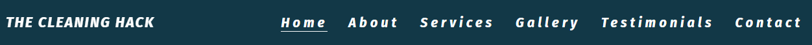

- This project includes a fully responsive navigation bar on all pages and consists of links to various pages all listed on the right side of the Company name.

- On smaller devices, the navigation bar is a burger icon, providing easy transition between various pages without the need of the 'back' browser button.

### Landing Page 

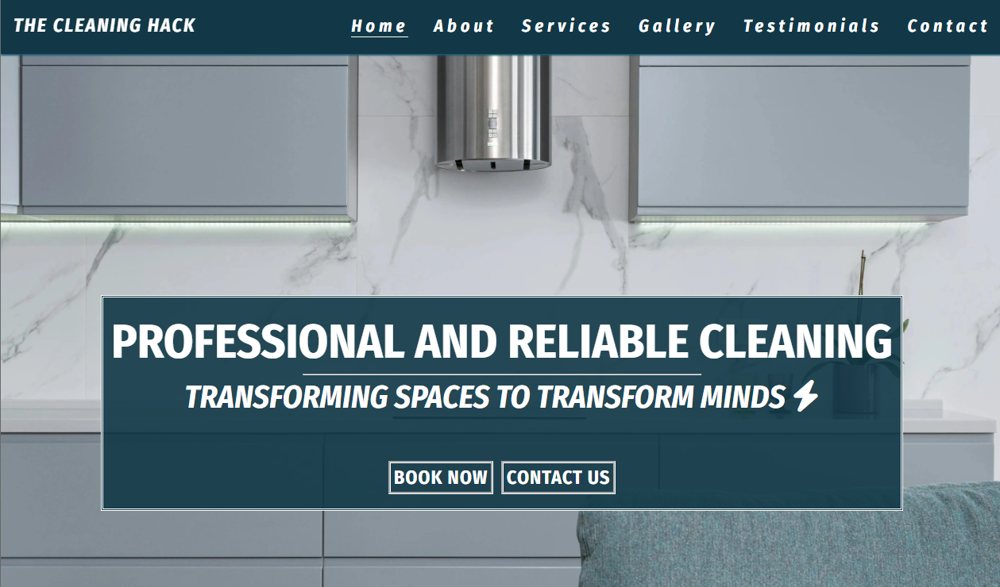

- The landing page includes a hero image with the Company slogan and two call to action buttons, 'Book Now' and 'Contact Us'.

- The 'Book Now' button is a convenient way for existing clients to schedule / reschedule cleaning visits with The Cleaning Hack or amend an existing booking.

- The 'Contact Us' button is especially useful for users who are less interested in perusing the contents of each page and just need a quote or have questions.

### about.html

### The Cleaning Hack About Page 

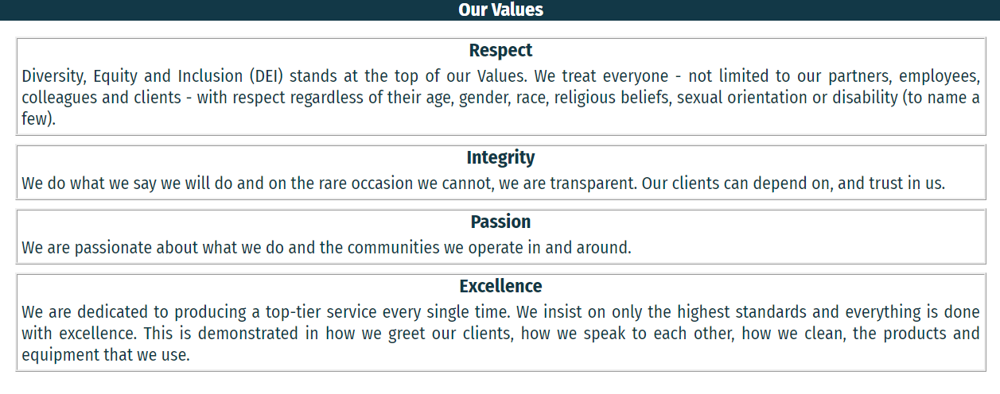

- The 'About' page section includes the Company Values, Mission and Vision.

- The page seeks to give prospects some insight into the business, and is an expression of The Cleaning Hack's passion for cleaning.

### services.html

### The Cleaning Hack Services Page 

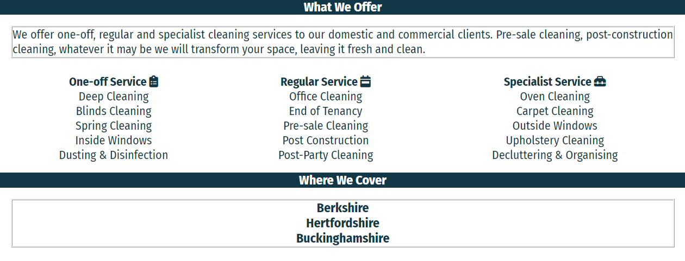

- The 'Services Page' includes a list of cleaning services offered and areas covered. It also includes a cleaning guarantee so prospects feel secure when booking with the Company.

- The 'Get Quote' button is a convenient way for prospects to obtain a cleaning estimate without the need to explore other sections of the website, if they do not wish to do so. This button directs prospects to the 'Contact' page.

### gallery.html

### The Cleaning Hack Gallery Page 

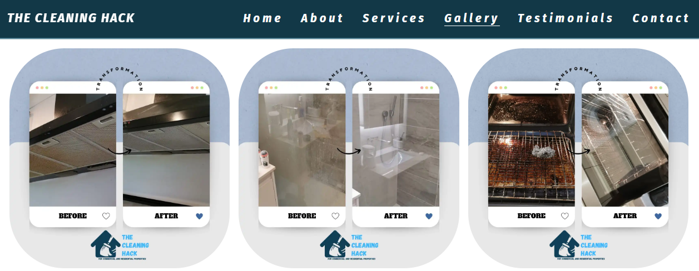

- The gallery page showcases previous jobs completed by the Company.

- It contains carefully selected photos of difficult-to-clean areas and large appliances, highlighting the Company's technical expertise.

### testimonials.html

### The Cleaning Hack Testimonials Page 

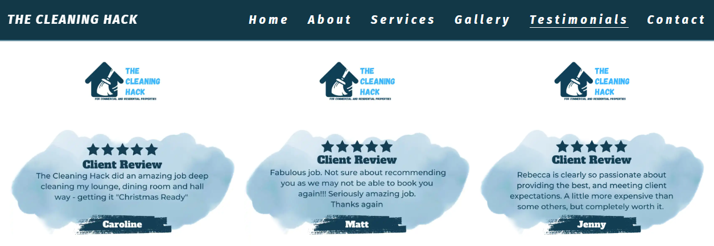

- The testimonials section includes real client reviews for jobs ranging from recurring domestic cleans to commercial cleans.

### contact.html

### The Cleaning Hack Contact Page 

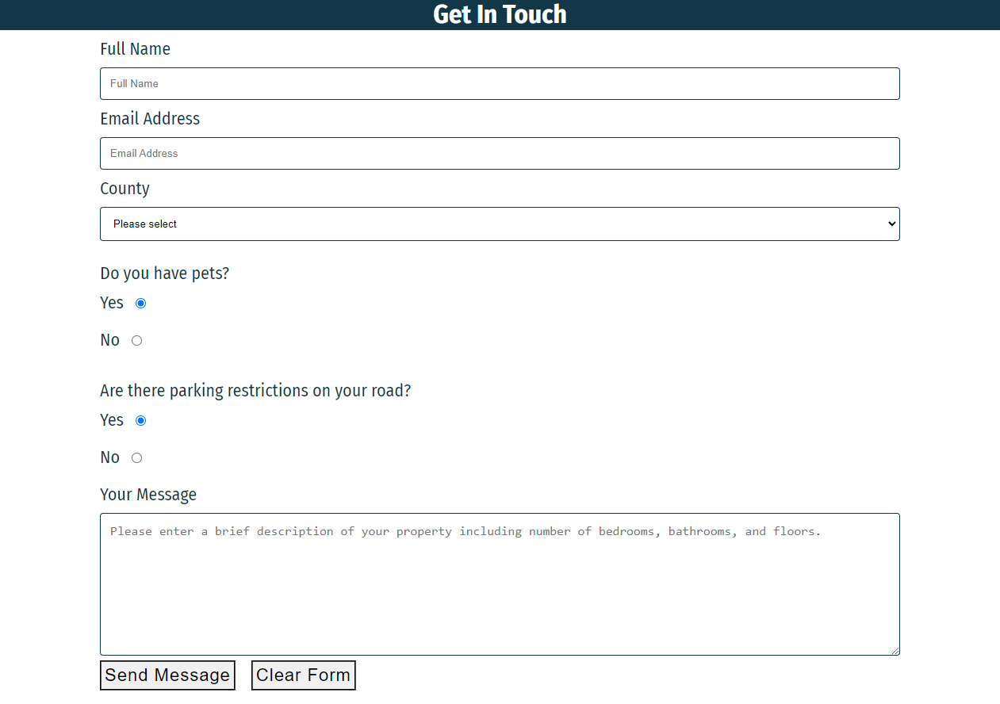

- The contact section includes a form requesting prospects to provide their Full Name, Email Address and to select a County from the drop-down. Prospects are also asked to indicate using 'Yes' or 'No' if they have pets and, if there are any parking restrictions on their road. 

- There is a message box that encourages prospects to provide a brief description of their property, including details such as the number of bathrooms, bedrooms, and other living areas. There is also a 'Clear Form' option available to the prospect.

### Footer

- This project includes an interactive footer on all pages.

- The footer is visible on all devices and includes clickable icons linking to The Cleaning Hack's social media pages.

## Future Features
### About Page
I would enhance the 'About' page through the inclusion of a section about the CEO. It would include a photo and brief background into the owner and how The Cleaning Hack got started.

### Services Page
I would like to introduce more animation and images on the 'Services' page.

### Testimonials
I would like to add card animation so that when visitors hover over client reviews, a before and after photo showcasing the particular work carried out for the client is displayed.

### Contact Us
I would like to develop and integrate a backend for the contact form to capture prospects details and improve on lead generation for the business. 

I would also like to add a WhatsApp option so prospects can send instant messages for a quicker response. 

### Additional Page Ideas
I would like to develop and integrate a cleaning calculator specifically for prospects with residential enquiries so that they can obtain an estimate of how much it would cost based on the size of their property.

## Technology

#### HTML
The backbone of website design and function; used to provide structure to the website.

#### CSS
Used to style the layout of each web page.

#### Font Awesome
Source of all the icons used in this project.

#### Google Fonts
Used to define the fonts used in the project (with the exclusion of the company logo). Also used to compate and pair font-styles.

#### Favicon.io
Used to generate a favicon for the existing logo.

#### Convert.io and Freeconvert.com
Used in the conversion of files from jpeg and png to webp to aid in faster webpage loading.

## Testing
Project testing was done manually by myself, my partner, my sister and a couple friends from the Slack community. This was necessary to determine the usability, stability and responsiveness of the website and to gauage if the website is user-friendly. 

### Testing Phase

#### Links and Contact Form
 | Test                                                      | Expectation | Outcome |
 |-----------------------------------------------------------|-------------|---------|
 | Navigation links lead to their intended pages             | Pass        | Pass    |
 | Book Now button leads to external booking page            | Pass        | Pass    |
 | Contact Us button leads to contact form on contact page   | Pass        | Pass    |
 | Learn More button leads to about page                     | Pass        | Pass    |
 | Social links on footer lead to their respective pages     | Pass        | Pass    |
 | Booking and social links open in a new tab                | Pass        | Pass    |
 | Get Quote button leads to contact form on contact page    | Pass        | Pass    |
 | Send Message and Clear Form buttons on contact form work  | Pass        | Pass    |
 | Users prevented from submitting empty form                | Pass        | Pass    |
 | Users prevented from submitting incorrect email format    | Pass        | Pass    |

 #### Testing for responsiveness
 | Test                                                      | Expectation | Outcome |
 |-----------------------------------------------------------|-------------|---------|
 | Home, about, services, gallery, testimonials and contact pages display correctly on mobiles and tablets (769px and lower)                       | Pass        | Pass    |
 | Home, about, services, gallery, testimonials and contact pages display correctly on laptops and desktops (992px and higher - up to 1200px)      | Pass        | Pass    |

 ### User Testing
 #### User testing Challenge
 Four users were asked to carry out the following when they arrived at the website:
 | Test                                                      | Result      |
 |-----------------------------------------------------------|-------------|
 | Navigate to business LinkedIn page                        | 100%        |
 | Navigate to contact form from home page                   | 100%        |
 | Fill in contact form with relevant details                | 100%        |
 | Clear form after details entered to reset all fields      | 100%        |
 | Navigate to business Google page                          | 100%        |

#### User Responsive Testing
Four users were asked to visit site on their mobile and/or table then provide feedback on issues where content was inaccessible or images and pages overlapping.
| Test | Result |
|------|--------|
|Issues Reported| None|

### Google Lighthouse Testing
#### index.html
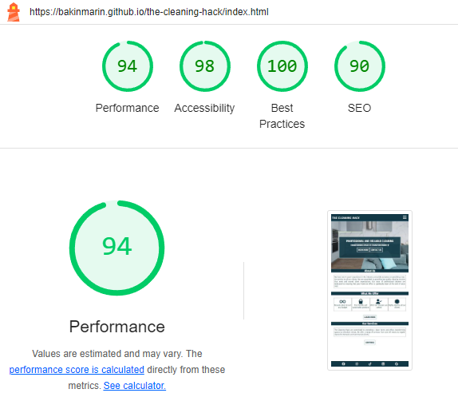

#### about.html
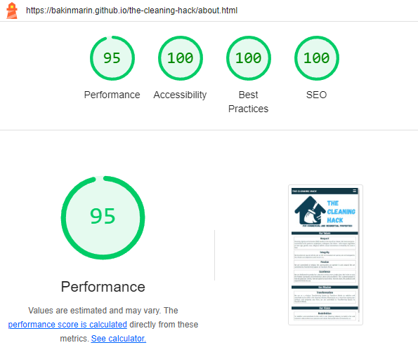

#### services.html
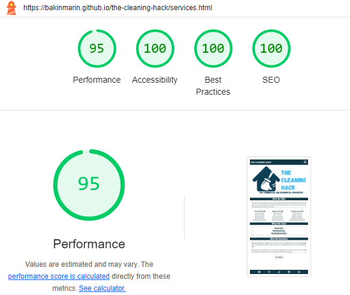

#### gallery.html
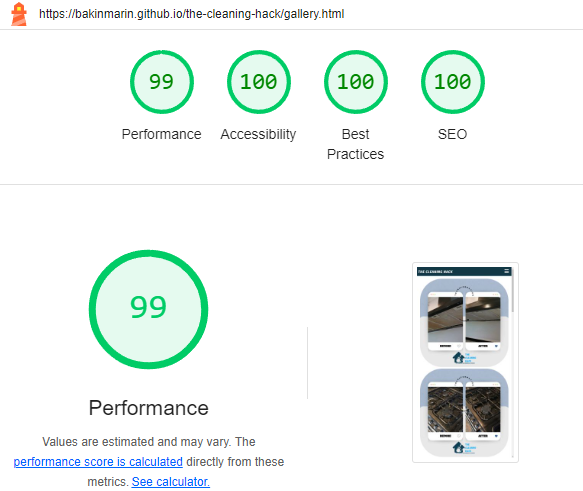

#### testimonials.html
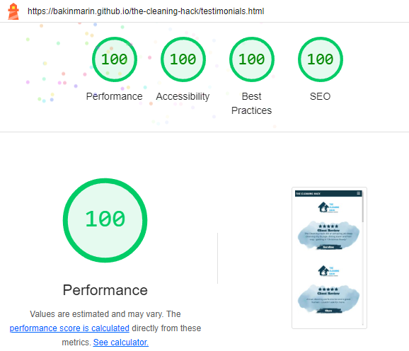

#### contact.html
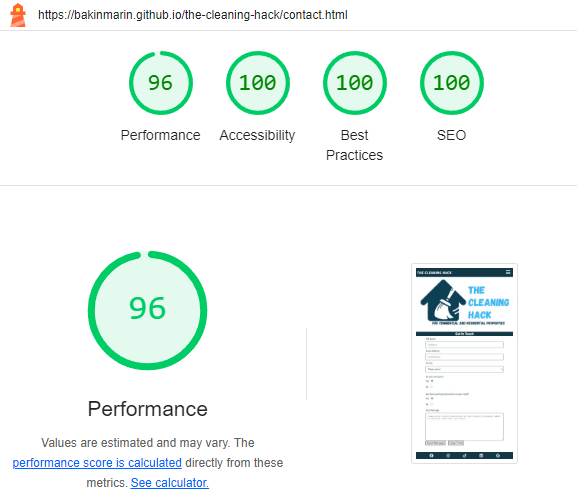

### HTML Validation
#### index.html

#### about.html

#### services.html

#### gallery.html

#### testimonials.html

#### contact.html

#### CSS Validation

## Bugs

### Solved Bugs
Parking Restrictions - Radio Button Grouping
- Unable to set selection to one radio button
  - Fixed this by setting the 'name' attribute for both buttons to the same name.

### Unsolved Bugs
No unsolved bugs found.  

## Deployment
To deploy the project I followed these steps starting from the main project repository linked above.

 1. Clicked on `Settings` on the navigation menu in the repository
 2. I then selected the `Pages` menu on the side bar.
 3. In the first dropdown menu labeled `Source` I selected the branch of the name `main` from the dropdown.
 4. In the next dropdown labeled `/root` I left as the default option.
 5. Selected Save.
 
I then received a notification from GitHub that my project is being deployed and after about 2 minutes and a couple of refreshes of the page it was ready and live.

## Credits
[Hero Image](https://www.pexels.com/photo/spacious-lounge-with-comfortable-sofa-and-electric-embedded-stove-6782358/)

## Content and Resources
### Company Logo
The Cleaning Hack logo as well as the text were sourced directly from the business owner.

### Google Fonts
Embedded code imported from Google fonts.

### Pexels.com
Used to source images for this project.

### css-tricks.com
Used to broaden my understanding of CSS flexbox properties.

### MDN Web Docs
Also used to research the application of CSS flexbox.

### w3 schools
Used when researching how to use CSS flexbox for responsiveness.

### YouTube
Free online resources used to research different real-life applications of CSS flexbox.

### Coode Institute
Project created in line with course content, walkthrough project and and within project 1 scope.

### AmIResponsive.com
Used to check responsiveness of the website

## Acknowledgements
### Owner of The Cleaning Hack
My partner, who set aside time to support with the ideation process and provided me with the media and some of the text used in this project.

### Alan Bushell
My mentor, who helped point me in the right direction when stuck on certain concepts.

