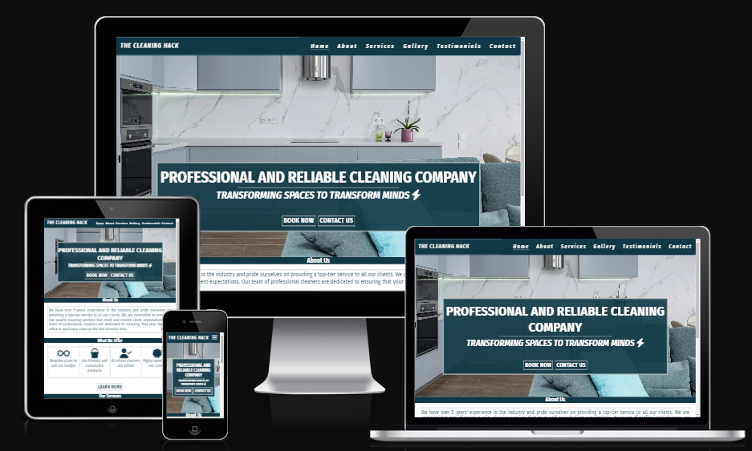

# The Cleaning Hack

This is a website built for my partner who owns a cleaning business with three employees. The business is based in Buckinghamshire, England with operations extending to Berkshire, Hertfordshire and, on ocassion, Bedfordshire.

## [Live Site](https://bakinmarin.github.io/the-cleaning-hack/)

## [Repository](https://github.com/BAkinmarin/the-cleaning-hack)

##  Table of Contents
1.  [UX](#ux)
2.  [Features](#features)
3.  [Features Left To Implement](#features-left-to-implement)
4.  [Technology Used](#technology-used)
5.  [Testing](#testing)
6.  [Bugs](#bugs)
7.  [Deployment](#deployment)
8.  [Credits](#credits)
9.  [Content](#content)
10. [Acknowledgements](#acknowledgements)

## UX
### Project Planning
During the project ideation stage, I limited my focus to friends and family as I was keen to build a website which would fulfill a real need. Discussions left me with three viable options - a do-over of my church website, a website for my sister to publish her stories, or a website for my partners current cleaning business. 

>All three options were considered in relation to existing technologies and alternatives. There is already a website for my church, there currently exist a host of platforms my sister can and publishes her work however, my partner does not have a separate website dedicated to her business hence I went with this option. 

### Strategy Plane

#### User
>As a user I want to be able to find a reliable cleaner in my area to clean my house. 
As a user I want to be able to contact the user via email or phone. 
As a user I want to be able to request a quote online. 
As a user I want to be able to book an appointment online.
As a user I want to be able to see the price. 
As a user I want to be able to see evidence of previous work. 
As a user I want to be able to read or hear from other people that have used this cleaner. 
As a user I want to be able to find out when the business is open.
As a user I want to be able to view social media accounts.

#### Business Owner
>As the site owner, I want to showcase the value we provide and the of quality work we deliver to our clients. 
As the site owner, I want to build trust and showcase our professionalism and reliability.
As the site owner, I want to generate leads and provide an easy way for prospects to book in and request quotes. 
As the site owner I want to use this website to attract more prospects from in and around Buckinghamshire. 
As the site owner, I want to attract potential talent to work for us. 
As the site owner I want the user to see my business opening hours.

### Scope Plane
>The website should have a Navigation menu that is consistent across all pages and devices.
The website should have clear messaging explaining to users who we are and what we do.
The website should provide a succinct list of services we provide to the user.
The website should build trust with the user through evidence provided in the form of testimonials and photos of cleaning jobs completed.
The website should provide the user with a way to contact the business for quotes or consultations through a form.
The website should provide the user with details of areas we operate in.

### Structure Plane
>Based on the information to be provided to the user, the website should include a minimum of six pages consisting of: Home, About, Services, Gallery, Testimonials and Contact.

#### Home Page
>Navigation with links to relevant pages.
Hero welcome message with call to action to take user to either an external booking page or a contact form.
Services page outlining types of work carried out and target audience. 
Gallery page showcasing some jobs carried out.
Testimonials page showcasing reviews from existing clients. 
Footer section with links to social media pages.

#### About 
>The about page should have the company logo, values, vision and mission statement.
The about page should explain any relevant information about the business in text format.

#### Services
>The services page should detail the different services provided by the business and what types of clients we service.

#### Gallery
>The gallery page should show before and after photos in an organised and responsive format. 

#### Testimonials
>The testimonials page should reveal client satisfaction stories in an organised and responsive format.

### Contact
>The contact page should have a contact form for the user to get in touch or request quote.
The form should collect contact details for the customer so that the business can contact them back. 
The contact form should include input options for name, email and message with yes or no selection for pets and parking restrictions.
The contact form should give user feedback on submission.
The contact form should give the user the option to clear form if any details are incorrect.

### Skeleton Plane
#### Balsamiq Wireframes
##### Landing Page

##### Gallery Page

##### Testimonials Page

##### Contact Page

>Description here

### Surface Plane

### Color

### Typography

## Features
- Navigation Bar
    - Fully responsive navigation bar on all pages.
    - The navigation bar is large enough to be clickable on smaller devices and provide easy transition between various pages without the need of the 'back' browser button.

>Place screenshot of landing page here

- The Landing Page
    - The landing page includes a hero image with the Company slogan and two call to action buttons, 'Book Now' and 'Enquire Now'.
    - The 'Book Now' button is a convenient way of existing customers to schedule a deep clean visit with the Cleaning Hack or amend an existing booking. It is also handy for visitors who are less interested in perusing the contents of each page and just need a quote or wanting to ask questions. 

- The Cleaning Hack About Section

- The Cleaning Hack Services Section

- The Cleaning Hack Testimonials Section

- The Cleaning Hack Gallery Section

- The Cleaning Hack Contact Section

## Features Left to Implement

## Technology used

#### HTML
>The backbone of website design and function; used to provide structure to the website.

#### CSS
>Used to style the layout of each web page.

#### Font Awesome
>Source of all the icons used in this project.

#### Google Fonts
>Used to define the fonts used in the project (with the exclusion of the company logo). Also used to compate and pair font-styles.

#### Favicon.io
>Used to generate a favicon for the existing logo.

#### Convert.io and Freeconvert.com
>Used in the conversion of files from jpeg and png to webp to aid in faster webpage loading.

## Testing
>Project testing was done manually by myself, my partner, my sister and a couple friends from the Slack community. This was necessary to determine the usability, stability and responsiveness of the website and to gauage if the website is user-friendly. 

### Testing Phase

#### Links and Contact Form
 | Test                                                      | Expectation | Outcome |
 |-----------------------------------------------------------|-------------|---------|
 | Navigation links lead to their intended pages             | Pass        | Pass    |
 | Book Now button leads to external booking page            | Pass        | Pass    |
 | Contact Us button leads to contact form on contact page   | Pass        | Pass    |
 | Learn More button leads to about page                     | Pass        | Pass    |
 | Social links on footer lead to their respective pages     | Pass        | Pass    |
 | Booking and social links open in a new tab                | Pass        | Pass    |
 | Get Quote button leads to contact form on contact page    | Pass        | Pass    |
 | Send Message and Clear Form buttons on contact form work  | Pass        | Pass    |
 | Users prevented from submitting empty form                | Pass        | Pass    |
 | Users prevented from submitting incorrect email format    | Pass        | Pass    |

 #### Testing for responsiveness
 | Test                                                      | Expectation | Outcome |
 |-----------------------------------------------------------|-------------|---------|
 | Home, about, services, gallery, testimonials and contact pages display correctly on mobiles and tablets (769px and lower)                       | Pass        | Pass    |
 | Home, about, services, gallery, testimonials and contact pages display correctly on laptops and desktops (992px and higher - up to 1200px)      | Pass        | Pass    |

 ### User Testing
 #### User testing Challenge
 >Four users are asked prior to visiting

#### User responsive testing
>

### Google Lighthouse Testing

### HTML Validation
#### index.html

#### about.html

#### services.html

#### gallery.html

#### testimonials.html

#### contact.html

#### CSS Validation

## Bugs

## Deployment

## Credits

## Content

- Media

## Acknowledgements

